# Visual pass

Compared with the maquette that was live before this branch. Before stills are the previous renderer (flat extrusions, thin road ribbons, one lawn color). Pavilion, Lancaster, and Walk did not exist as presets, so those before frames are the aerial fallback.

## What changed

- **Roads.** Each OSM centerline is a cross-section: asphalt, curbs, sidewalks, shoulders on the expressway, edge lines, and a double-yellow or dashed center where the class calls for it. Intersections get asphalt discs so junctions are not grass. Paths stay gravel. The rail corridor is ballast, ties, rails, and catenary poles. Ambient cars sit on the asphalt, offset into a lane or the curb.
- **Buildings.** Brick and stone walls are masonry only. The opening is a modelled bay: glass set back, a projecting sill, head, and jambs, plus a mullion. Long walls get piers and corner quoins. Cornices and flat roofs overhang the wall; simple rectangles get a hip or gable with an eave. St. Thomas of Villanova is a buttressed nave with pointed bays, a south portal and rose, a gabled roof, and a central spire. Falvey steps back over a south portico. The law school is a glass curtain wall with a roof overhang. Finneran Pavilion is ribbed metal with a barrel roof. Villanova Stadium is a seating bowl, marked field, goals, and four light towers, not a windowed extrusion of the outer ring.
- **Ground.** The DEM is still what walk mode stands on. The lawn mesh uses a green albedo, a large soft grass texture (no blade-stroke tile), and vertex colors for broad patches, path dirt, and darker contact along walls. A few decimetres of height variation flatten on pavement. Near the core, crossed grass cards add blades at walk distance. There is no custom grass shader: an earlier one failed to draw and left the clear color.
- **Trees.** Instanced canopies and trunks line Lancaster, collectors, and residential streets, with shrubs and smaller trees along paths inside the core, and a ring around the quad. The south sightline to the church is kept clear. Canopies cast shadows. They are simple lit meshes, not scanned trees.
- **Cameras.** The church preset stands due south of St. Thomas, close enough that the nave and spire fill the frame. The open-lawn anchor used for the quad sits on the same line as Tolentine Hall, so a camera placed there looks through the church at Tolentine. `scripts/audit-cameras.mjs` projects both buildings and fails if Tolentine is nearer the screen center than St. Thomas, if the spire is cropped, or if the church does not fill the frame. It also replays that rejected bearing and requires the replay to fail. Lancaster looks along the avenue. Walk starts just north of that stretch, eye height 1.68 m on the DEM. The stadium camera looks down into the bowl.
- **Light.** Default hour is 15:09. The sun is paired with a hemisphere and a cool fill so stone and brick are not a single hard wash. Shadows use a soft PCF radius and follow the camera target. The sky is a pale horizon, a lighter zenith, a dust band, and a few procedural clouds, with light fog so the aerial view is not a model on a flat blue sheet. There is no SSAO and no god-ray pass.

## Stills

| View | Before | After |
| --- | --- | --- |
| Aerial | 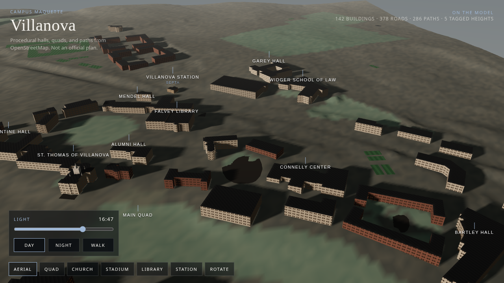 | 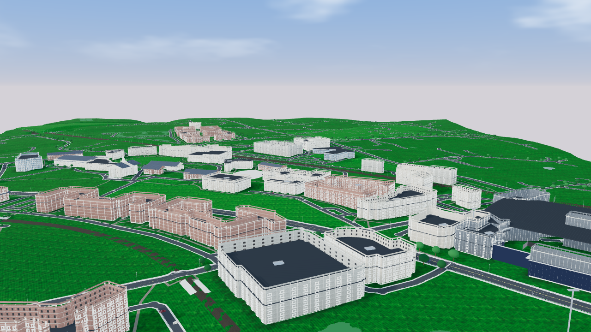 |
| Quad | 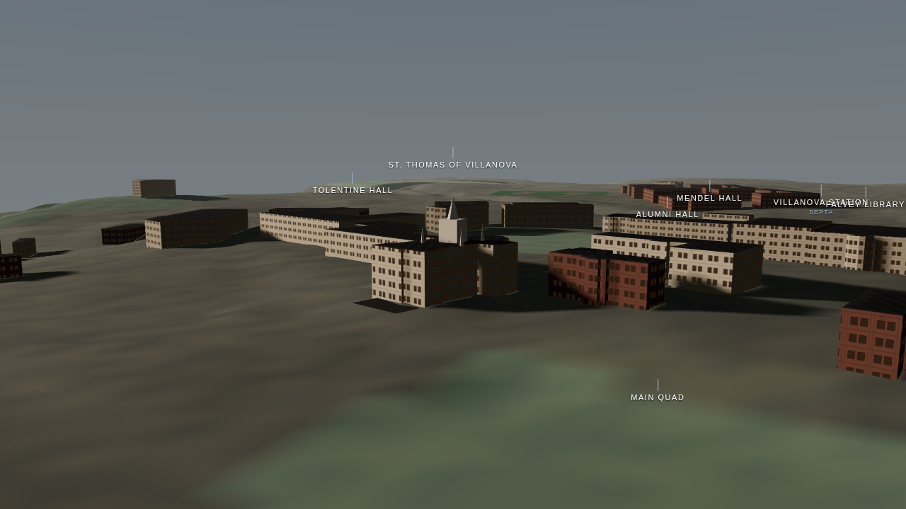 | 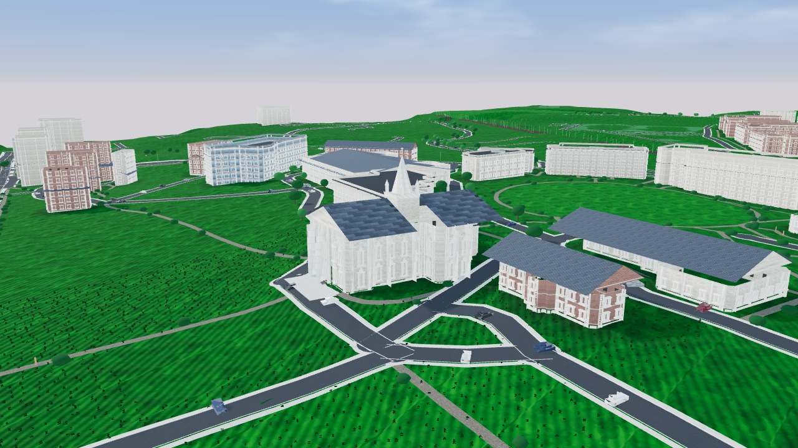 |
| Church | 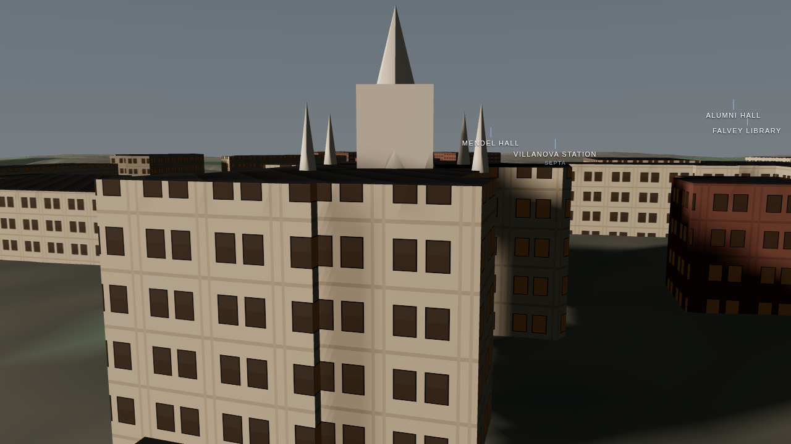 | 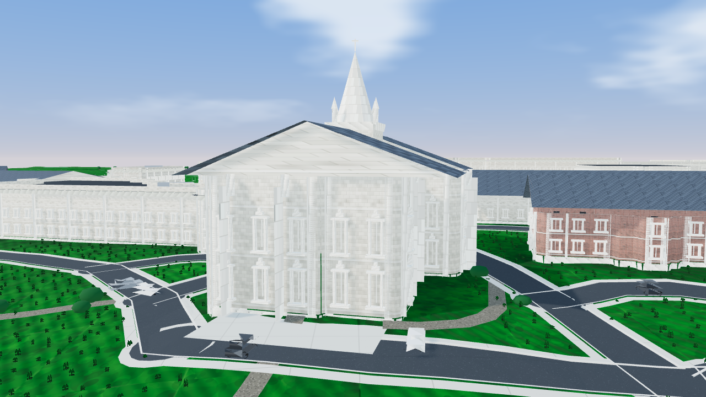 |
| Stadium | 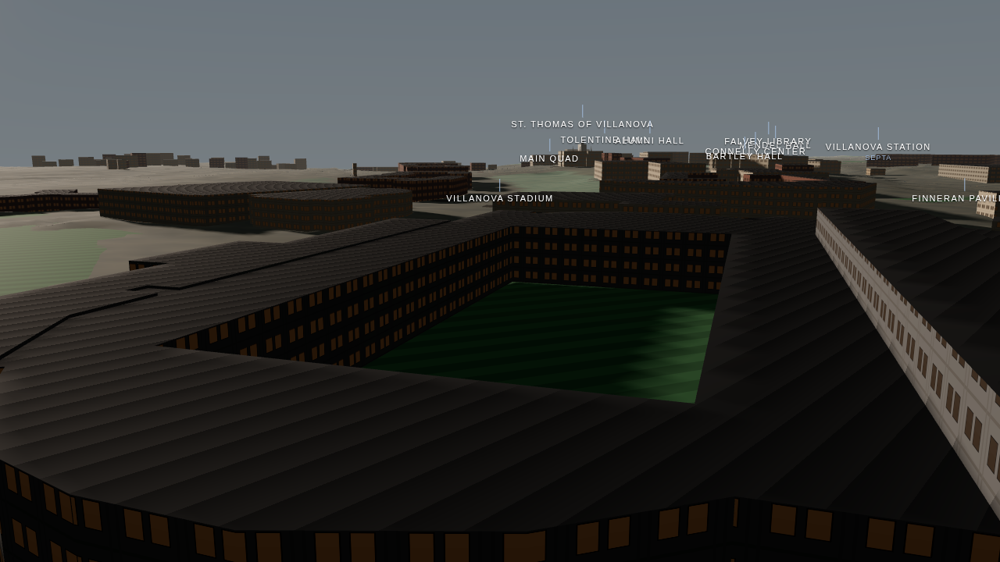 | 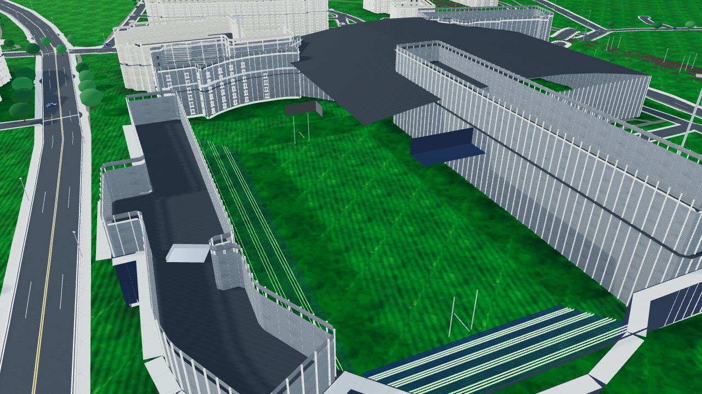 |
| Library | 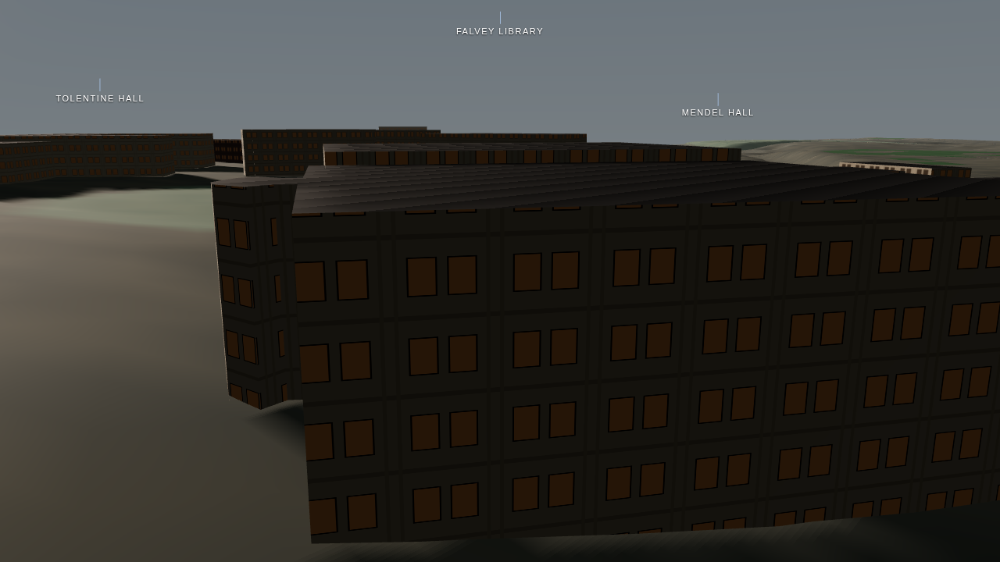 | 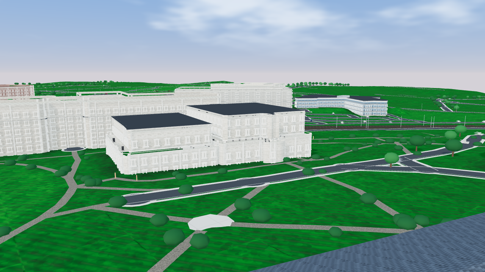 |
| Pavilion |  | 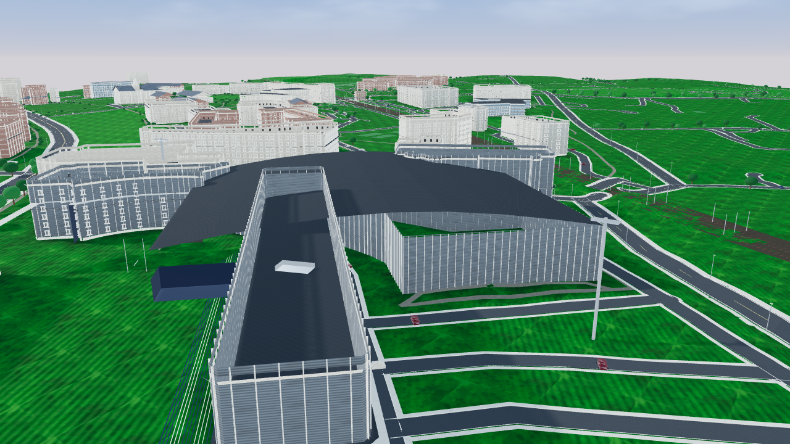 |
| Station | 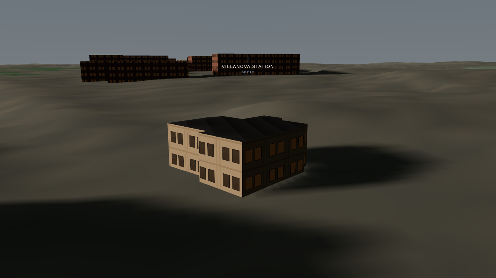 | 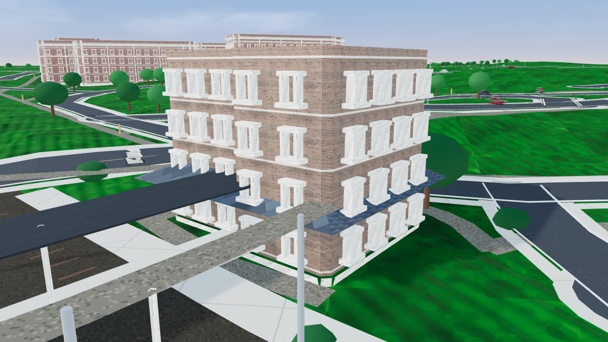 |
| Lancaster |  | 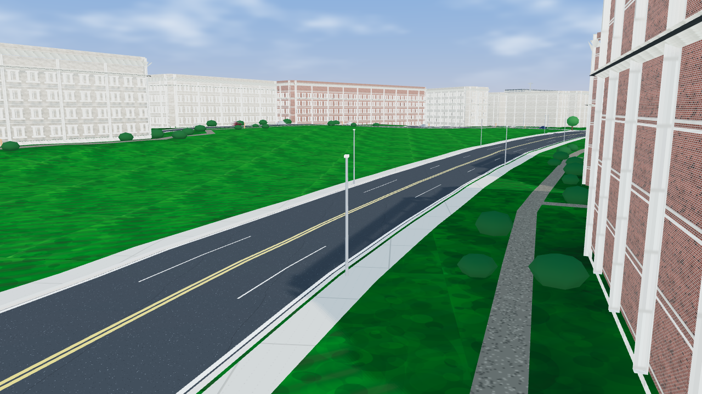 |
| Walk | 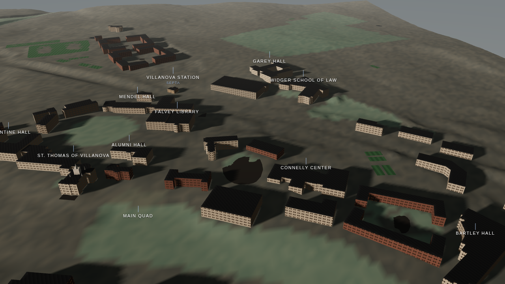 | 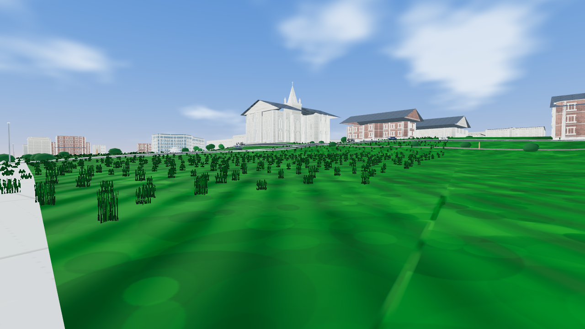 |

## Still short of a game-engine campus

This is still a web model of OSM rings, not a surveyed mesh, and not an Unreal scene.

- Secondary halls share a few families. An L-shaped footprint keeps a flat roof so a gable does not float off the wings. Bays repeat inside a family. They are modelled frames on masonry, not unique carved stone.
- There is no screen-space AO and no photogrammetry. Depth comes from the bays, cornices, curbs, tree shadows, and the ground mask.
- The church nave is 16.5 m and the modeled spire is 34 m so the steeple clears the roof. The OSM height tag is about 30 m and is shorter than the real steeple.
- Grass cards cover the core walks and the quad, not the whole extract. Farther lawn is shaded ground with a soft texture.
- Trees are instanced spheres and cylinders. Cars are ambient scenery, not a live traffic feed.
